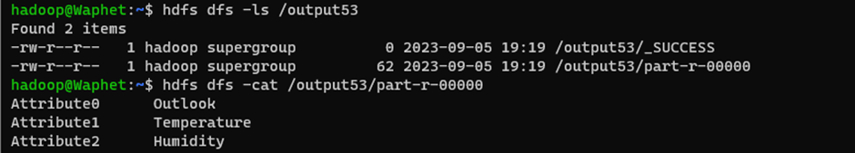

# DecisionTreeMapReduce-in-Hadoop
# Decision Tree Classifier using Hadoop MapReduce

This repository contains a Hadoop MapReduce implementation of a Decision Tree Classifier for analyzing and classifying data.

## Table of Contents

- [Introduction](#introduction)
- [Requirements](#requirements)
- [Usage](#usage)
  - [Cloning the Repository](#cloning-the-repository)
  - [Running the Decision Tree Classifier](#running-the-decision-tree-classifier)

## Introduction

This MapReduce program is designed to build a decision tree classifier using the Hadoop framework. It reads a dataset, computes impurity, selects the best attribute splits, and generates a decision tree.

## Requirements

- Hadoop installed and configured
- Java Development Kit (JDK) installed
- Input data in CSV format

## Usage

### COMMANDS
#### -For compiling
hadoop com.sun.tools.javac.Main <JavaFileName.java>
#### -For creation of Jar file
 jar cf <Jarfilename.jar> javafilename*.class
#### -To copy your input file to hdfs
 hdfs dfs -put <homeDirectory> <destinationDirectory>
 Eg: hdfs dfs -put /home/hadoop/DecisionTree.txt /input
#### -For executing the program
 hadoop jar <jarfilename.jar> <mainclassname> <inputdirectory> <newOutputDirectory>
 Eg:
 hadoop jar DecisionTree.jar DecisionTree /input/Decisiontree.txt /output
#### -To get output
 hdfs dfs -ls /output
 inside that, you can see part files.
 to view that,
 hdfs dfs -cat /output/part-00000
 

 
### Cloning the Repository

Clone this repository to your local machine using the following command:

```bash
git clone https://github.com//Devadharshani-A/DecisionTreeMapReduce-in-Hadoop.git
cd decision-tree-mapreduce

